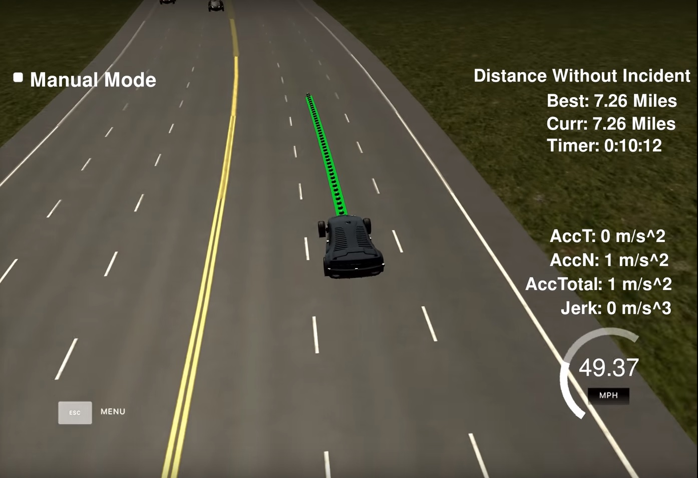
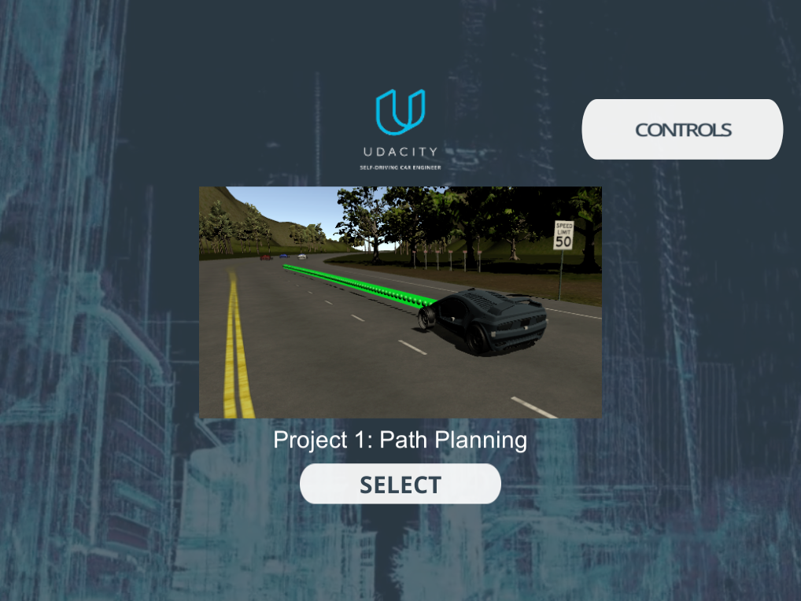

# Term - 3 - Project - 1 : Path Planning
Self-Driving Car Engineer Nanodegree Program - Path Planning Project

---
## Path Planning Project Output

This video recording demonstrates how the car performs in the simulator, being controlled by my path
planner implementation: 

[](https://youtu.be/3UhmN3r_SqE)

## Path Planning Project Overview

This project is a part of Udacity's *Self-Driving Car Nanodegree* program. The goal of this project is to navigate a car around a simulated 3 lane highway scenario, including traffic and given waypoint, telemetry, and sensor fusion data. In this project, the goal is to design a path planner that is able to create smooth, safe paths for the car to follow along a 3 lane highway with traffic. A successful path planner will be able to keep inside its lane, avoid hitting other cars, and pass slower moving traffic all by using localization, sensor fusion, and map data. The car must not violate a set of motion constraints, namely maximum velocity, maximum acceleration, and maximum jerk, while also avoiding collisions with other vehicles, keeping to within a highway lane (aside from short periods of time while changing lanes), and changing lanes when doing so is necessary to maintain a speed near the posted speed limit.

This implementation is summarized in the following five steps:
1. Construct interpolated waypoints of nearby area
2. Determine ego car parameters and construct vehicle object
3. Generate predictions from sensor fusion data
4. Determine best trajectory
5. Produce new path

## Prerequisites

The project has the following dependencies (from Udacity's seed project):

- cmake >= 3.5
- make >= 4.1
- gcc/g++ >= 5.4
- libuv 1.12.0
- Udacity's simulator.

For instructions on how to install these components on different operating systems, please, visit [Udacity's seed project](https://github.com/udacity/CarND-Path-Planning-Project). 

## Valid trajectories

* **_The car is able to drive at least 4.32 miles without inciden:_** Simulator ran for 7.5 mies without any incidents


* **_The car drives according to the speed limit:_** No speed limit red message was seen.

* **_Max Acceleration and Jerk are not Exceeded:_** Max jerk red message was not seen.

* **_Car does not have collisions:_** No collisions.

* **_The car stays in its lane, except for the time between changing lanes:_** The car stays in its lane most of the time but when it changes lane because of traffic or to return to the center lane.

* **_The car is able to change lanes:_** The car change lanes when the there is a slow car in front of it, and it is safe to change lanes (no other cars around) or when it is safe to return the center lane.

## Reflection and Project Structure
The car is able to drive at least 4.32 miles without incident. The car drives according to the speed limit. Max Acceleration and Jerk are not Exceeded. Car does not have collisions. The car is able to change lanes.

We generate new way points from the current position of the car using the frenet coordinates. We use the current frenet coordinate of the car and extrapolate the path for next 30 meters.

In the code, the task is split into 3 stages, each implemented as a separate class:

### Prediction 
This part of the code deal with the telemetry and sensor fusion data. It intents to reason about the environment. In the case, we want to know three aspects of it:

- Is there a car in front of us blocking the traffic.
- Is there a car to the right of us making a lane change not safe.
- Is there a car to the left of us making a lane change not safe.

These questions are answered by calculating the lane each other car is and the position it will be at the end of the last plan trajectory. A car is considered "dangerous" when its distance to our car is less than 30 meters in front or behind us. `Predictor` takes the current vehicle's position as well as the information about other cars from the sensor fusion data. The goal of this class is to analyze the situation around my own vehicle and generate the prediction if vehicle's current, left and right lanes are available for maneuvering. 

### Behavior 
This part decides what to do:
  - If we have a car in front of us, do we change lanes?
  - Do we speed up or slow down?

`Behavior` takes the prediction information and calculates which maneuver to perform. Available maneuvers are: keep the lane at the maximum speed; change left or right; return to the center lane; follow the car ahead, adjusting own velocity to avoid collision. Based on the prediction of the situation we are in, this code increases the speed, decrease speed, or make a lane change when it is safe. This approach makes the car more responsive acting faster to changing situations like a car in front of it trying to apply breaks to cause a collision.

### Trajectory
This code does the calculation of the trajectory based on the speed and lane output from the behavior, car coordinates and past path points. `Trajectory` takes the recommendations provided by the behavior unit and generates the trajectory for the car to execute the maneuver. While generating the trajectory, this class makes sure that the car stays within the speed limit and performs the maneuver smoothly. Effectively, the trajectory is a cubic spline.

First, the last two points of the previous trajectory (or the car position if there are no previous trajectory) are used in conjunction three points at a far distance to initialize the spline calculation. To make the work less complicated to the spline calculation based on those points, the coordinates are transformed (shift and rotation) to local car coordinates.

In order to ensure more continuity on the trajectory (in addition to adding the last two point of the pass trajectory to the spline adjustment), the pass trajectory points are copied to the new trajectory. The rest of the points are calculated by evaluating the spline and transforming the output coordinates to not local coordinates. The speed change is decided on the behavior part of the code, but it is used in that part to increase/decrease speed on every trajectory points instead of doing it for the complete trajectory.

## Compiling and executing the project

In order to build the project there is a `./build.sh` script on the repo root. It will create the `./build` directory and compile de code. This is an example of the output of this script:

The project could be executed directly using `./build/path_planning`

```
> cd build
> ./path_planning
Listening to port 4567
```

Now the path planner is running and listening on port 4567 for messages from the simulator. Next step is to open Udacity's simulator:



Click the "Select" button and hope for the best on the highway.


## Compilation

### The code compiles correctly.

No changes were made in the cmake configuration. A new file was added [src/spline.h](src/spline.h). It is the [Cubic Spline interpolation implementation](http://kluge.in-chemnitz.de/opensource/spline/): a single.h file you can use splines instead of polynomials. It was a great suggestion from the classroom QA video. It works great.

## Conclusion

It is possible to drive without difficulty even with fairly dense traffic, and according to the designed cost, when there is a safe path that guarantees a better speed, the vehicle travels as close to max_speed as possible through lane change if there is slow vehicle ahead. As the degree of freedom of the project was high, It was nice to be able to think about various ways to solve the problem.

It is a video that the car drives for about 5 minutes at a distance of about 7.5 miles without collision without violating the constraint. Maybe it seems to be able to drive more, but it did not mean much, so it ended in the middle: [Youtube link for 2x speed](https://youtu.be/3UhmN3r_SqE).
